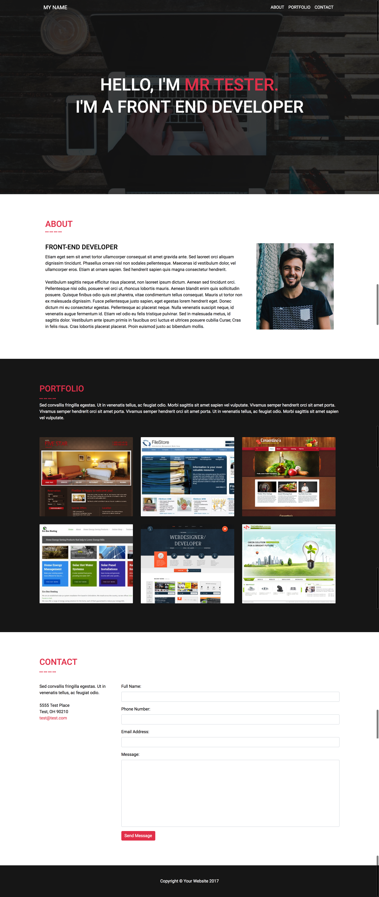

#  | 
# Front End Development Test
Create a portfolio website for yourself. Convert the following images to HTML/CSS/JS and host on Github. Be creative!

## Requirements:
  * Ensure website is responsive
  * Use Github to host your portfolio website
  * Optimize all images
  * Ensure the website works and displays correctly in all modern browsers

## Programming languages and plugins needed:
  * HTML
  * CSS
  * Javascript
  * Bootstrap 4

## Optional:
  * Jquery
  * Font-awesome
  * Animate css
  * Google Font - Roboto
  
## Breakdown of website:
  * Create effect for navigation that transitions to a solid background on scroll
  * Create scroll animation when clicking on each section in the navigation. Make sure each tab links to the appropriate section
  * Provide a photo and a description of your experience in the About section
  * Create hover effect for portfolio items in the Portfolio section and use your own example websites to link out to
  * Put together form and general contact information for the Contact section

# Bonus:
  * You can use animate.css to spice things up
  * Get the contact form working
  
# Delivery:
  * Please send us the link to your Github site once it's complete

# Project Deadline:
  * We would like to see this completed in a week but if you have a big workload please let us know and we can give you more time.
